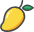
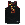

# Snakee

## Brief Project Description
This project is based on a classic retro game called Snake. A new runnable implementation was created. My task was to maintain and develop this software.

### Developed Using

  

## How to Install and Run

### Installation:
Install the following, selecting your device platform. Your machine must be up to date with Java19 for the project to run.
- [Java19 SDK](https://www.oracle.com/uk/java/technologies/downloads/#jdk19)
- [IntelliJ](https://www.jetbrains.com/idea/download/#section=windows)

### Steps to run:
1. Download the src folder
2. Unzip the folder
3. Load IntelliJ Community Edition and open the CW-Snake folder located in GribbleJack_Java19 folder
4. At the top select File > Project Structure > SDK 
5. Check the Java19 SDK is there. If not click the '+', locate your Java19 SDK directory and add it to the project
6. In Project Structure go to Project and check it is sdk 19, if not find the sdk 19 directory and select it
7. Open the Maven Tab on the right
8. Click CW-Snake > Plugins > javafx > javafx:run and the game will run
9. After this, you can also press the play button top right to run the game

  

## How to Play

### Start Screen
When you launch the game, you'll see the start screen. 

Here's what you can do:
- **Adjust Settings** - Use the dropdown menus to customise your experience. You can choose the:
    - Theme of the Game
    - Difficulty
    - Text colour for the score
    - Whether bombs are on or off
- **Enter Your Name** - Type your name in the text box at the top.
- **View the Rules** - Click the Rules button to see the game rules. 

- **Check the Leaderboard** - Click the Leaderboard button to see the local high scores. 

- **Start the Game** - Press the Play button to begin!

### Gameplay
Once the game starts, control the snake and try to achieve the highest score!
- Use the **arrow keys** or **WASD** to control the snake.
- Avoid **bombs** and **walls**—hitting them ends the game.
- Eat **food** to grow longer and increase your score.
- Be careful not to collide with yourself, or it's game over!

Depending on the theme selected, the game wil look different.

There are multiple levels to the game, as the snake gets long the level will increase, with a popup showing to alert you. Each level increases the speed of the snake and the spawn rate of the obstacles.

### Game Over
When the game ends, your **score and name** will be displayed.

You'll have two options:
- **Play Again** – Return to the start screen to setup another game.
- **Exit** – Close the game.

Enjoy playing! 🚀🐍

## Themes

### [Snake Theme](screenshots/snake)

**Player:**

 
 
 

**Food:**

**Wall:**

**Bomb:**

**Background:**

### [Football Theme](screenshots/football)

**Player:**

**Food:**

**Wall:**

**Bomb:**

**Background:**

### [Basketball Theme](screenshots/basketball)

**Player:**

**Food:**

**Wall:**

**Bomb:**

**Background:**

